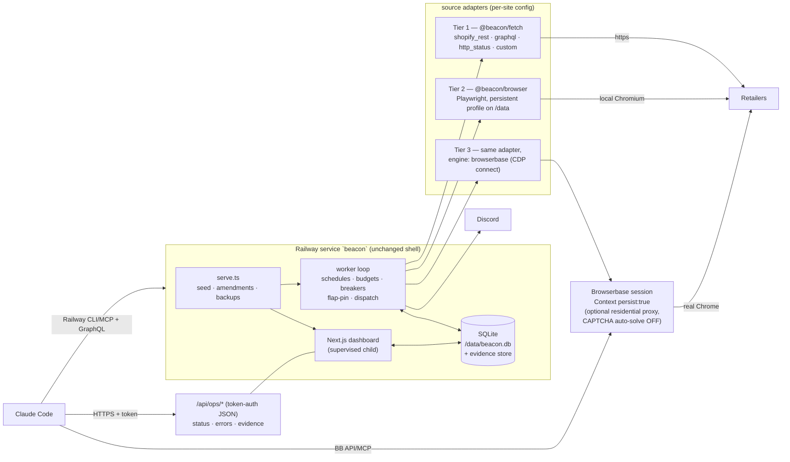

# Hosting & Execution Architecture — decision document

> Written 2026-07-23 as an analysis-and-planning pass (no production code,
> config, env, or external services were changed). Companion docs:
> **`MIGRATION_CHECKLIST.md`** (the phased plan) and
> **`RETAILER_CHECK_STRATEGY.md`** (tier rules, sessions, blocking, escalation).
>
> Platform capabilities below were verified against official documentation on
> 2026-07-23 (citations inline). Items that could not be pinned to official-doc
> text are marked **UNVERIFIED** and collected in §17 Open questions.

---

## 1. Current-state summary (audited from the repo, not from memory)

**What Beacon is.** A single-operator hobby monitor for whiskey retail pages:
detect new products / restocks, alert via Discord. Never multi-user, never
commercial.

**Stack (v2, live since 2026-06-22).**

- **Language/frameworks:** TypeScript ESM monorepo (pnpm workspaces, Node 20).
  Runtime deps are deliberately minimal: `zod`, `drizzle-orm` + `@libsql/client`,
  `next`/`react` (dashboard), `tsx` (TS runtime). No HTTP client dependency —
  `packages/fetch` is a hand-rolled `node:https` client.
- **Frontend:** Next.js 14 app-router dashboard (`apps/web`) — sites/products/
  history/reminders/schedules pages, server actions for all edits, single-user
  signed-cookie auth (HMAC, `BEACON_AUTH_SECRET` ?? `BEACON_DASH_PASSWORD`).
- **Backend:** one resident process (`apps/server/src/serve.ts`): seeds/repairs
  the DB, applies one-time config amendments, runs rotated `VACUUM INTO`
  snapshots, runs the **worker loop in-process**, and supervises the Next.js
  dashboard as a restart-with-backoff child.
- **Database/ORM:** SQLite (libSQL) file at `file:/data/beacon.db` on a mounted
  Railway **volume**, via Drizzle. Tables: `sites` (Zod-validated JSON
  definitions), `site_state`, `alert_history`, `schedules`, `ignored_products`,
  `reminders`, `commands` (dashboard→worker queue), `secrets` (e.g. Storefront
  tokens), `meta` (heartbeat, latches), `host_identities` (persisted browser
  header identities).
- **Railway services:** exactly one (`beacon`), branch `main`, Nixpacks build
  from `railway.json` (`pnpm install && pnpm typecheck && pnpm --filter
  @beacon/web build`; start `pnpm --filter @beacon/server start`), `ON_FAILURE`
  restart policy, one volume at `/data`.
- **Scheduling mechanism:** a forever loop (`apps/worker/src/loop.ts`), ~60 s
  base (±jitter), tightening to ~10 s while any site is in **imminent mode**.
  Per-site gating by `shouldCheck()`: named schedules with ET time windows and
  day-of-week rules (`drop_windows`, `bar_evening` — cadences *mined from the
  app's own alert history*), deterministic 0.9–1.15× cycle jitter, imminent
  overrides, circuit-breaker cooldowns (5→15→60→180 min) with a read-side 15-min
  clamp inside drop windows, and a wedge watchdog (no completed pass in 15 min →
  `exit(1)` → platform restart).
- **Website-checking mechanism:** **raw HTTPS only — no Playwright, Puppeteer,
  or Selenium anywhere in the repo.** Source adapters: `shopify_rest`
  (paginated `products.json`, conditional GET with a 15-min full-revalidate
  bound, Storefront-GraphQL fallback channel with channel-preference and
  flap-pinning feedback loops), `shopify_graphql` (Storefront API + live Buy
  Button embed discovery), `http_status` (page-state probe: password walls,
  coming-soon), `custom`/`campari_v1` (server-rendered HTML parser).
- **Notifications:** Discord webhook (`packages/notify`), color-coded embeds,
  429-aware. Alert types: new_product / restock / sold_out / site_reset /
  site_changed / site_error / site_recovered / system_degraded / self_healed
  (dashboard-only) / baseline / imminent_timeout.
- **Environment variables (names only):** `BEACON_DB_URL` (`DATABASE_URL`
  fallback), `BEACON_DB_AUTH_TOKEN`, `BEACON_DASH_PASSWORD`,
  `BEACON_AUTH_SECRET`, `DISCORD_WEBHOOK_URL`, `HEALTHCHECK_URL`,
  `BEACON_DRY_RUN`, `BEACON_DATA_DIR`, `BEACON_SEED_ONLY`, `BEACON_NO_WORKER`,
  `BEACON_NO_WEB`, `BEACON_FORCE_SEED`, `BEACON_BACKUP_INTERVAL_H`, `GH_TOKEN`,
  `GH_REPO`, `PORT` (platform-injected).
- **Persistent disk:** the `/data` volume holds the SQLite file + rotated
  snapshots. Browser header identities and all check state persist in the DB.
- **Background processes:** the worker loop; the supervised web child; a 6-hourly
  backup timer; a daily Storefront-token harvest; a daily GitHub history mirror
  (`analytics/alert_history.jsonl` — currently silent since Jul 20, suspected
  `GH_TOKEN` expiry).
- **Queueing/locking:** the `commands` table (dashboard → worker, drained per
  pass). Concurrency control is *implicit*: the loop is *sequential*, one site
  at a time, with politeness jitter between sites — so there is never more than
  one in-flight request per retailer. SQLite runs WAL + busy_timeout for the
  two-process (worker+web) file share.
- **Expected duration of a normal check:** one HTTPS request (~0.5–3 s) for most
  sites; multi-page scans a few seconds; hard per-site budget 60 s
  (`PER_SITE_BUDGET_MS`); a full pass over ~8 sites typically well under a
  minute including politeness gaps.
- **In-memory state that matters:** the host-identity cache (persisted to DB
  every ~30 loops and on rehydrate), process-level once-per-start warning sets,
  and the systemic-alert latch. Everything decision-relevant (cooldowns,
  streaks, flap history, recentlySeen, validators) lives in `site_state`.

**Features that require a continuously running process (serverless-misfit
flags):**

1. The **~10 s imminent loop** (sub-minute cadence during drop windows) — below
   the 1-minute floor of every managed cron (Vercel Hobby is *daily*-only).
2. The **wedge watchdog + supervised web child + in-process backup timer** —
   process-lifetime constructs.
3. **SQLite on a local volume** — meaningless on any FaaS (no persistent disk;
   Vercel confirms SQLite is unsupported for persistent writes:
   [vercel.com/kb/guide/is-sqlite-supported-in-vercel](https://vercel.com/kb/guide/is-sqlite-supported-in-vercel)).
4. **Sequential per-host politeness** comes free from the single loop; a
   fan-out scheduler must rebuild it as explicit per-host locks.
5. The circuit-breaker/flap/preference **feedback loops** read-modify-write
   state each pass; they'd survive a stateless executor only after a DB move
   (Turso/Postgres) and careful concurrency work.

---

## 2. Requirements (from the operator, 2026-07)

- **R-1 (primary):** checks should obtain the same page state a normal user
  sees; reduce the odds of being identified/blocked as automation. Rotating IPs
  is explicitly *not* the goal; legitimate browser behavior and session
  coherence are.
- **R-2:** no *requirement* for a continuously running server; checks must be
  triggerable manually, via API, on fixed and temporarily-changed cadences, on
  CRUD-able schedules, faster during release windows, and locally for debugging.
- **R-3:** per-retailer least-complex-that-works checking (plain HTTP → real
  browser → hardened remote browser + optional proxy, in that order).
- **R-4:** Claude Code must be able to administer the environment (deploys,
  logs, env, executions, errors) through CLI/API/MCP.
- **R-5:** hobby-scale cost and one-person operational complexity.
- **Non-goal:** defeating CAPTCHAs, logins, purchase limits, or any access
  control. Detection-and-report only.

## 3. Primary reliability objective

Maximize the probability that, during a drop window, Beacon sees the same
product roster a human shopper in Northern Virginia sees — and when it cannot,
that it *knows* it cannot (block/challenge classified, evidence captured,
operator paged) rather than reporting a false "no change."

The July incidents define the bar: the Jul 22 miss was not a scheduling failure
— it was **channel blindness composed with anti-noise guards**. The fixes
shipped (503 in `BLOCKED_STATUSES`, 304 revalidation bound, newest-first
fallback, cooldown clamps, earlier paging) address the Tier-1 layer; this
document addresses the two structural gaps Tier 1 cannot fix from a datacenter
IP: **TLS/client fingerprint honesty** and **egress reputation**.

---

## 4. Current blocking analysis — what actually makes Beacon look automated

Audit of `packages/fetch` + adapters against the checklist, with impact ratings.

**Where the current design is already strong** (do not regress these in any
migration): stable 6–24 h per-host header identities persisted across restarts;
kind-coherent headers (`api` vs `document` Sec-Fetch shapes); conditional GET;
deterministic jitter at every level (no metronome); sequential single-flight
per host; circuit-breaker ladder + drop-window clamp; channel fallback with
flap-pinning; block-vs-outage discrimination (`BLOCKED_STATUSES`, stall/tar-pit
detection, empty-guard, drift-guard, 🩺 diagnose); data-tuned cadences with an
overnight near-stop.

**Real weaknesses:**

| # | Finding | Blocking risk | False OOS | False in-stock | Maintenance | Cost | Debugging |
|---|---|---|---|---|---|---|---|
| W1 | **TLS fingerprint mismatch.** `node:https` produces a Node JA3/JA4, while headers claim Chrome 136. Any WAF that fingerprints TLS sees the contradiction. This is the single biggest honesty gap and cannot be patched with headers. | **High** | Med (blocks → stale roster) | Low | — | — | — |
| W2 | **No cookie continuity.** The client never accepts/replays cookies; a "Chrome" that never carries `_shopify_y`/session cookies across visits is anomalous. | Med | Low | Low | — | — | — |
| W3 | **No JS execution.** Fine for JSON/API endpoints (correct tier); fatal for future JS-rendered targets (Total Wine/Costco) and blind to challenge pages that resolve in-browser. | Med (per-site) | Med | Low | Med | — | — |
| W4 | **Synthetic navigation context.** `products.json` is fetched with `Sec-Fetch-Site: same-origin` + `Referer: origin/` although no page navigation ever occurred; no HTML/asset requests ever accompany it. Plausible-ish, but a WAF correlating request sequences sees API-only traffic. | Med | Low | Low | — | — | — |
| W5 | **Datacenter egress reputation** (Railway IPs, shared; occasionally bursting via AWS/GCP — [docs.railway.com/railway-metal](https://docs.railway.com/railway-metal)). The demonstrated 403/429/430/503s on sharedpour.com. Not fixable on-platform: Railway static IPs are Pro-only **and shared** ([docs.railway.com/networking/static-outbound-ips](https://docs.railway.com/networking/static-outbound-ips)). | **High** (site-dependent) | Med | Low | — | — | — |
| W6 | **`Accept-Language` roulette.** Identities can roll `en-GB` from a US IP — a needless incoherence. One-line fix in `profiles.ts`. | Low | — | — | — | — | — |
| W7 | **No response-body evidence on failure.** Only the error string + status survive; the actual block/challenge HTML is discarded, so classification (challenge vs outage) leans on status codes alone — the exact gap that delayed the 503 diagnosis. | — | Med (misclassification) | — | Med | — | **High** |
| W8 | **Imminent mode bypasses cooldowns** (by design) — at 2-min cadence into an already-hostile host this can deepen a block exactly when it hurts most. Acceptable operator-eyes-on trade-off, but worth knowing. | Med (during drops) | — | — | — | — | — |
| W9 | **Fragile-selector exposure** is limited (JSON APIs mostly) but `campari_v1` and future HTML sources parse markup; drift-guard catches yield collapse, not subtle misreads. | Low | Med | Low | Med | — | — |
| W10 | **Sold-out vs blocked at Tier-1 edges:** handled well for full failures; a *partial* success (some pages fetched, then blocked) currently surfaces as an error, not a partial-roster ambiguity class. | Low | Low–Med | Low | — | — | — |

**Explicitly *not* problems:** identical timing (jitter everywhere), excessive
frequency (data-tuned, overnight-quiet), concurrent same-host requests
(sequential loop), one-size-fits-all strategy (per-site recipes + fallbacks).

---

## 5. Architecture options

- **A. Remain entirely on Railway (status quo + additive browser tier)** — keep
  the one-service resident worker; add Playwright locally (Dockerfile) and/or a
  remote browser for the hardened tier; wire up Railway CLI/API/MCP for Claude.
- **B. Vercel only** — dashboard + API + cron-triggered checks as functions.
- **C. Vercel + Apify** (the operator's candidate) — Vercel web/API, Apify
  actors + API-managed schedules for checks, hosted Postgres.
- **D. Vercel + Browserbase** — Vercel web/API/cron, checks in functions that
  drive Browserbase sessions, hosted Postgres/Turso.
- **E. Railway + Apify or Browserbase** — keep the resident worker/dashboard on
  Railway; browser-tier checks execute remotely (worker calls Apify run-sync or
  Browserbase CDP). *(A with a remote Tier 3 is E with Browserbase — they
  converge; kept separate to score Apify-as-executor.)*
- **F. Apify as platform + scheduler** — actors do everything; app hosted
  separately or as Apify Standby.
- **G. Other, revealed by the repo:**
  - **G1. Fly.io lift-and-shift** — same container, volume, resident process;
    `flyctl` for agent operability.
  - **G2. Small VPS (Hetzner)** — same process under systemd; SSH-only ops.
  - **G3. Cloudflare Workers + Browser Run + D1/DO** — full rewrite onto CF
    primitives.
  - **G4. Home server (residential egress)** — the only *free* fix for W5;
    noted honestly, not scored as primary (hardware/ops burden, undiscussed).

## 6. Comparison matrix

Scoring against the criteria that actually differentiate (all options can send
Discord webhooks and store secrets adequately). ✔ = good/native, ~ = workable
with effort, ✘ = poor/blocked. Citations: [1]–[18] in §16.

| Criterion | A Railway (evolved) | B Vercel only | C Vercel+Apify | D Vercel+BB | E Railway+BB (rec.) | F Apify-centric | G1 Fly | G2 VPS | G3 Cloudflare |
|---|---|---|---|---|---|---|---|---|---|
| Check reliability (browser realism available) | ✔ (local PW + BB Tier 3) | ✘–~ (sparticuz Chromium, Fluid friction [5]) | ✔ (PW images) | ✔ | ✔ | ✔ | ✔ | ✔ | ~ (browser yes, datacenter IP [13]) |
| Real Chromium + JS | ✔ | ~ | ✔ | ✔ | ✔ | ✔ | ✔ | ✔ | ✔ |
| Persistent browser context/profile per retailer | ✔ (volume userDataDir; BB Contexts `persist:true` [10]) | ✘ (no disk [6]) | ~ (cookie JSON in named KV store — no real user-data-dir [9]) | ✔ (BB Contexts) | ✔ | ~ | ✔ (volume) | ✔ (disk) | ~ (manual cookie export via DO/KV [13]) |
| Coherent retailer session (cookies, locale, geo stable) | ✔ | ~ | ~ | ✔ | ✔ | ~ | ✔ | ✔ | ~ |
| Normal navigation paths | ✔ | ~ | ✔ | ✔ | ✔ | ✔ | ✔ | ✔ | ✔ |
| Screenshots / HTML / console / network capture | ✔ (own code + BB recordings/logs/live-view [11]) | ~ | ✔ (KV records, run logs) | ✔ | ✔ | ✔ | ✔ (own code) | ✔ (own code) | ~ |
| Block/challenge detection | ✔ (already best-in-class at Tier 1) | ~ (rebuild) | ~ (rebuild) | ~ (rebuild) | ✔ (kept) | ~ (rebuild) | ✔ (kept) | ✔ (kept) | ~ (rebuild) |
| Optional residential proxy path | ✔ via BB per-session [12] | ✘ native | ✔ ($8/GB [9]) | ✔ ($12/GB incl 1 GB [12]) | ✔ | ✔ | ~ (BYO) | ~ (BYO) | ✘ native |
| Dynamic scheduling (5-min windows, imminent ≤1 min, CRUD) | ✔ (already built, DB-driven) | ✘ Hobby cron = daily [4]; Pro = 1-min floor | ~ (Apify schedules API, 1-min floor, rebuild all feedback loops [8]) | ~ (same rebuild) | ✔ (kept) | ~ | ✔ (kept) | ✔ (kept) | ~ (1-min cron floor, DO alarms for less) |
| Manual "check now" | ✔ (commands table) | ✔ | ✔ | ✔ | ✔ | ✔ | ✔ | ✔ | ✔ |
| Execution-duration constraints | none | 300 s Hobby / 800 s Pro [3] | 300 s run-sync, else async [7] | 300–800 s | none | none (actors unbounded) | none | none | ~ (10-min keep_alive windows [13]) |
| Persistent state (current SQLite) | ✔ unchanged | ✘ → forced DB migration | ✘ → forced | ✘ → forced | ✔ unchanged | ✘ → forced | ✔ (Fly volume) | ✔ | ✘ → D1 rewrite |
| Logs/observability for prod | ✔ CLI historical+JSON [1], MCP [2] | ~ (1 h Hobby / 1 d Pro retention [5]) | ~ (two dashboards) | ~ (two dashboards) | ✔ + BB session replay | ~ | ✔ (`fly logs`, ssh) | ✔ (ssh) | ~ |
| Claude Code/Codex administration (CLI/API/MCP) | ✔ CLI+GraphQL+official MCP [1][2] | ✔ CLI+MCP [5] | ✔ both vendors have MCPs [8] | ✔ | ✔ (+BB MCP [11]) | ✔ | ✔ flyctl incl. `ssh console` [14] | ✔ (ssh = total) | ✔ (wrangler) |
| Local development parity | ✔ (`file:` DB, same process) | ~ | ~ (apify run local vs cloud) | ~ | ✔ | ~ | ✔ | ✔ | ~ (miniflare-ish) |
| Migration complexity | **none→XS** | XL (rewrite) | **XL** (scheduler+state rewrite, 2 vendors, DB move) | L–XL | **XS–S** (additive) | XL | S–M (container+volume move) | M (provision+harden) | XL |
| Est. monthly cost (hobby) | ~$7 now; ~$15–22 with in-container Chromium [15] | $20 Pro + DB | $20 Pro + ~$19–57 Apify [9] + DB | $20 Pro + $20 BB + DB | ~$7 + $20 BB *only when Tier 3 armed* | ~$49 Starter (UNVERIFIED [9]) | ~$5–12 [16] | ~$5 [17] | ~$5–9 [13] |
| Vendor lock-in | Low (plain Node + SQLite) | Med | Med–High (actor model) | Med | **Low** (BB behind an adapter; CDP is portable) | High | Low | None | High (CF primitives) |
| Runs without major rewrite | **✔** | ✘ | ✘ | ✘ | **✔** | ✘ | ✔ | ✔ | ✘ |

**Why C (the candidate) loses, concretely:**

1. It solves problems Beacon doesn't have. Scheduling is not broken — it's the
   best-tuned part of the system (data-mined windows, imminent mode, flap
   pinning, cooldown clamps). Porting those feedback loops onto Apify schedules
   + stateless actors is a large rewrite with regression risk and zero
   reliability upside; Apify's 1-minute cron floor also can't express the ~10 s
   imminent loop.
2. It *forces* costs Beacon doesn't need: Vercel Hobby's daily-only cron makes
   Pro ($20/mo) mandatory for any 5-min cadence [4]; no persistent disk forces
   the SQLite→Postgres/Turso migration on day one [6]; Apify browser runs land
   ~$19–57/mo at monitoring cadence [9]. Three vendors, three dashboards, three
   failure domains — for a one-person app.
3. Its session story is weaker than the alternative: Apify persists cookie JSON
   in a KV store; Browserbase persists the *actual browser profile*
   (user-data-dir) as a named Context [9][10].
4. What C genuinely buys — real browsers, schedules-as-API, capture — options A/E
   buy additively, without touching the parts that already work.

---

## 7. Recommended architecture (primary)

**E/A converged: evolve in place — keep the Railway single-service resident
worker; make execution tiered; escalate individual retailers to Browserbase;
wire Railway + app operability for Claude.**

**The moves, in order of value per unit of change:**

- **7a. Operability first (no architecture change).** Problem #2 turns out to be
  a *wiring* gap, not a platform gap: Railway has a headless CLI (historical +
  streaming logs with `--json`, variables list/set, `up --ci`, `redeploy`,
  `status`) [1], a public GraphQL API including `deploymentRollback` [1], and an
  **official MCP server** (local CLI-backed and hosted `mcp.railway.com`)
  exposing deploys, logs, and variables [2]. Provision a project-scoped token,
  put it in `.env.local` and the Claude environment config, done. Add the
  app-level `/api/ops/*` JSON surface (status, errors, evidence) so *any*
  session can inspect prod over HTTPS regardless of platform — that surface is
  platform-neutral insurance.
- **7b. Evidence capture (small code, big debugging win).** Persist bounded
  failure evidence (body snippet, headers, phase) at Tier 1; screenshots/HTML/
  console at Tier 2/3 (W7). This is what makes every later escalation decision
  evidence-driven instead of vibes-driven.
- **7c. Tier-2 browser adapter (`@beacon/browser`).** One new package
  implementing the existing `SourceAdapter` contract with Playwright:
  persistent per-host profiles on the volume, state-based waits, result
  classification, evidence capture; a new `browser` source kind in the Zod
  union. Local Chromium ships in the Railway image via the officially-guided
  Dockerfile (+~1 GB RAM ≈ +$8–15/mo [15]) — **or** this step can be skipped in
  prod and Tier 2 pointed straight at Browserbase (same adapter, `engine`
  flag), keeping the image lean. Decide during Phase 2/3 of the checklist based
  on whether a datacenter-IP browser actually passes the hostile hosts (if it
  doesn't, in-container Chromium buys nothing and Browserbase is the tier).
- **7d. Tier-3 = Browserbase, per-retailer, evidence-gated.** Developer plan
  ($20/mo, 100 browser-hours, 25 concurrent — far beyond need) [12]; named
  **Context** per retailer with `persist: true` (real user-data-dir continuity)
  [10]; session recordings/logs/live-view for diagnosis [11]; **residential
  proxy per session only after the checklist's step-6 evidence**, geo-pinned to
  one US region [12]. **Disable CAPTCHA auto-solving** (`solveCaptchas: false`)
  — Browserbase ships it on by default on paid plans, and it's outside this
  project's rules (§2 non-goal); a CAPTCHA is a *detect-and-page* event.
  Budget check: even 100 one-minute-billed sessions/day ≈ 50 h/mo — inside the
  plan; the tiering rules keep browser cadence well below Tier-1 cadence anyway.
- **7e. Keep everything else exactly where it is.** SQLite on the volume, the
  scheduler, the breakers, the dashboards, Discord, the mirror. They are the
  accumulated, incident-hardened value of this codebase; no platform migration
  improves them.

**What this does for the primary objective (same-page-state-as-a-user):**
Tier 2/3 checks present a real Chrome TLS/JS/cookie fingerprint (closes W1–W3),
navigate like a returning visitor with a persistent profile (closes W2/W4), and
— only where evidence shows IP reputation is the residual blocker — egress from
residential space (closes W5) with everything else held coherent. Tier 1 keeps
carrying the sites where it demonstrably works.

## 8. Tiered checking model

Defined in full in `RETAILER_CHECK_STRATEGY.md` §2–3. Summary: **Tier 1**
(structured HTTP — today's adapters; correct-by-design for Shopify JSON/API),
**Tier 2** (Playwright, persistent per-retailer profile, state-based waits,
navigation realism), **Tier 3** (same script on Browserbase: Contexts, stealth
hygiene, optional pinned residential egress, lower frequency, stronger
backoff). Promotion needs 7-day evidence on both Tier-1 channels or a confirmed
miss; demotion via low-frequency lower-tier probes; one tier move per 7 days
max (hysteresis). Current assignment: every live site stays Tier 1;
Campari sites are the most likely first Tier-2 promotions; Total Wine/Costco
onboard at Tier 2 expecting Tier 3.

## 9. Human-like browser strategy

Full rules in `RETAILER_CHECK_STRATEGY.md` §4 (sessions/identity) and §1b/2.
Essence: one persistent profile per retailer host; stable UA/locale
(`en-US`)/timezone (`America/New_York`)/viewport/US geo; first visit lands on
the homepage/collection so the site sets its own cookies, later visits go
straight to the watched page like a bookmark user; wait on page state, never
fixed sleeps; **no fake mouse/scroll/click theater** — interactions only where
they genuinely reveal stock state; per-host single-flight; schedule jitter
(already built); block/challenge/consent/login detection with evidence; backoff
that outlasts the block. Tier 1 keeps its existing header-identity system with
the `Accept-Language` fix (W6).

## 10. Retailer-specific configuration model

Beacon already has the right home for this: **site definitions are Zod-validated
JSON in the DB, editable live from the dashboard (⚙ source editor), no deploy
needed**. Extend, don't invent:

- **In the Zod source union (code defines shape, DB holds values):** a new
  `browser` source kind —
  `engine` (`local` | `browserbase`), `profileKey` (defaults to host),
  `startUrl`, `navigationSteps[]` (typed: goto/waitFor/click-limited),
  `waitSignals[]` (selector / response-URL / app-state predicate),
  `stockRules` (selector text / embedded-JSON path / observed-response JSON
  path), `expectedIndicators[]`, `blockIndicators[]`, `consentIndicators[]`,
  `loginIndicators[]`, `maxExecutionMs`, `screenshotOnFailure` /
  `htmlOnFailure` (default true), `proxy` (`none` | `residential`,
  `geo`), and existing cross-tier fields reused as-is: schedule, jitter (built
  into `shouldCheck`), retry/backoff (circuit breaker), dedup windows
  (`RESEEN_WINDOW_MS`), concurrency (global single-flight).
- **Per-retailer (host-level) rather than per-site:** browser profile identity,
  proxy mode, geographic region, tier — one `retailer_policy` row per host (new
  small table), because rate limits, bot scores, and sessions are per-host
  (the same lesson as host-level pin propagation).
- **In the `secrets` table (existing):** Browserbase API key, proxy creds if
  ever BYO, Storefront tokens (already there).
- **In code only:** tier ladders, thresholds, classification logic — behavior,
  not data.
- **In env:** platform credentials (`BROWSERBASE_API_KEY` ref name, etc. — see
  §13).

This preserves the project's rule: *adding or tuning a site is data, not code.*

## 11. Claude Code administration model

Verified operations per platform in the recommended architecture ("Git" = works
through git push alone; "CLI"/"API"/"MCP" = the named mechanism; "Dashboard" =
still manual):

| Operation | Mechanism (Railway) | Mechanism (Browserbase) | Notes |
|---|---|---|---|
| Deploy code | Git (auto-deploy on `main`) · CLI `railway up --ci` [1] | n/a (no code hosted there under this design) | |
| Deployment status | CLI `railway status` / `deployment` [1] · MCP [2] | — | |
| Runtime logs | CLI `railway logs --json` (historical via `--lines/--since`) [1] · GraphQL `deploymentLogs` · MCP `get-logs` [2] | API `GET /v1/sessions/{id}/logs` [11] | |
| Inspect failed executions | app `/api/ops/*` + DB evidence rows (to build, §7b) | session recordings/replay API, live-view [11] | check-level truth lives in the app, deliberately platform-neutral |
| Browser-run logs / screenshots / HTML | app evidence store | BB recordings + own captures | |
| List env-var names | CLI `railway variable list --json` [1] · MCP | — | names only; values need explicit intent |
| Add/update env vars | CLI `railway variable set` [1] · GraphQL · MCP `set-variables` [2] | — | |
| Trigger a production execution | app: `commands` table via dashboard action or an `/api/ops/run-now` endpoint (to add) | API create-session (ad-hoc probe) · BB MCP `navigate/extract` for interactive debugging [11] | |
| Inspect execution results | app `/api/ops/*` + history export + daily GitHub mirror (already built) | dataset n/a | |
| Roll back a deployment | **GraphQL `deploymentRollback`** [1] or dashboard; no CLI subcommand found (UNVERIFIED whether `railway deployment` gained one) | — | document the GraphQL one-liner in the runbook |
| Manage / pause / resume schedules | app: schedules are DB rows + dashboard; API-manageable once `/api/ops` exists — **no platform involvement** (a designed advantage) | — | |
| Run the workload locally | `BEACON_DB_URL=file:beacon.db` + `pnpm --filter @beacon/server start` (unchanged); browser tier: same adapter with `engine: local` | Stagehand/Playwright against a session for A/B | |
| Compare local vs hosted behavior | 🩺 diagnose (runs from server egress) vs the same probe locally — an existing, underused superpower | BB session vs local run of the identical script | |

Manual-dashboard-only residue on Railway: initial token minting, volume
operations, plan changes. Everything day-to-day is CLI/API/MCP.

## 12. Observability model

Per-check record (extends `checkHistory`/`errorLog` into a proper
`check_records` + `check_evidence` pair; bounded per site):

retailer/site id · product context · started/finished · execution environment
(`railway` | `local` | `browserbase:sessionId`) · tier · mode (http/browser) ·
profile/context key used · final URL (after redirects) · HTTP status ·
page title (browser tiers) · detected result category · confidence
(`certain`/`probable`/`ambiguous`) · block/challenge detection detail ·
extraction rule that fired (or failed) · retry count · duration · screenshot
ref · HTML ref · console errors · relevant failed network requests ·
notification decision (sent / suppressed-by: quiet/damper/reappearance/dedup) ·
error classification.

**Result categories** (drive state + alerting): `in_stock`, `out_of_stock`,
`page_unavailable`, `blocked`, `challenge_page`, `login_required`,
`consent_interrupt`, `structure_changed`, `extraction_failed`, `timeout`,
`ambiguous`. Hard rule (already the codebase's instinct, now made explicit):
**only `in_stock`/`out_of_stock` from a confident parse may mutate the product
roster; `ambiguous` is never treated as out-of-stock** — everything else
preserves prior state, captures evidence, and follows the §6 retry table in
`RETAILER_CHECK_STRATEGY.md`.

Existing surfaces that stay: dashboard tiles/PulseStrip/error panels, 🩺
diagnose (extended to browser tiers: run the same navigation from the server
and verdict it), history export API, daily GitHub mirror, healthchecks.io
dead-man (once armed), Discord paging ladders.

## 13. Security model

- **13a.** Local + Claude-session credentials live in **`.env.local`** at the
  repo root (git-ignored — verify `.gitignore` covers it before first use;
  add `docs/` runbook note). Names: `RAILWAY_TOKEN` (project-scoped token, not
  account [1]), `BROWSERBASE_API_KEY` (+ `BROWSERBASE_PROJECT_ID`),
  `BEACON_OPS_TOKEN` (the `/api/ops` bearer), optionally `GH_TOKEN`
  (fine-grained, Contents on this repo only). Never echo values; Claude lists
  names only.
- **13b.** Production values stay in Railway service variables (existing
  practice). Browserbase key also becomes a `secrets`-table ref for the
  adapter, consistent with Storefront tokens.
- **13c.** Least privilege: Railway *project* token (deploy-scoped, can't touch
  the account) [1]; GH PAT fine-grained to this repo; Discord webhook is
  already write-only by nature; ops token is read-mostly (run-now is the only
  mutating op) and rotatable via env.
- **13d.** Proxy credentials (if BYO ever happens) and any future notification
  creds follow the same split: env/secrets table, never config JSON, never git.
- **13e.** Dashboard auth stays single-user signed-cookie; the standing
  Cloudflare Access idea from `TODO.md` remains optional hardening, orthogonal
  to this decision.

## 14. Migration plan

Full checklist in `MIGRATION_CHECKLIST.md`. Shape: **Phase 0** operability
wiring + dead-man + rollback rehearsal → **Phase 1** two-week measured baseline
from existing telemetry → **Phase 2** Tier-2 adapter proven on a friendly
retailer as a dry-run twin → **Phase 3** hostile-retailer escalation ladder
(local browser → profile → navigation → tuning → politeness → Browserbase → and
only then proxy), documenting which step actually moves reliability → **Phase
4** side-by-side live parallel with a separate webhook → **Phase 5**
per-retailer cutover on explicit criteria, duplicates retired one at a time.
Because the plan is additive, "rollback" at every phase is config-level (flip
the site's source back in the dashboard), and Railway is never in a
half-migrated state.

## 15. Risks

- **15a. Scope creep in the browser tier** — Playwright invites feature growth.
  Mitigation: the adapter implements the existing `SourceAdapter` contract and
  nothing else; navigation steps are declarative config, not code per site.
- **15b. Railway RAM growth** if in-container Chromium ships (~+$8–15/mo, and a
  Docker build to maintain [15]). Mitigation: the `engine` flag makes local
  Chromium optional; Phase 3 evidence decides if it earns its keep.
- **15c. Browserbase dependency** for Tier-3 retailers (pricing/plan changes;
  Hobby tier already vanished once [12]). Mitigation: CDP-connect is a
  commodity interface — the adapter's `engine` abstraction keeps Steel
  (self-hostable, Apache-2.0) or a Fly-hosted browser as drop-in successors
  [18].
- **15d. Two execution paths per promoted retailer** (Tier-1 sentinel + browser
  check) — more moving parts. Mitigation: the tier rules cap this at the
  handful of retailers that earn it; the reappearance guard already handles
  cross-channel roster differences.
- **15e. Sub-minute imminent cadence at Tier 3** would burn browser-hours and
  look aggressive. Rule: imminent mode's cooldown bypass does not extend to
  Tier 3 without operator confirmation (encoded in the strategy doc).
- **15f. Detection arms race** — a WAF update can still win a round. The
  design's answer stays the same as today's: classify honestly, capture
  evidence, page the operator (who can buy in a browser in 30 seconds), never
  fabricate certainty.
- **15g. Doing nothing about the mirror/dead-man** (ops debt predating this
  plan) would undermine Phase 1's measurements — hence Phase 0.

## 16. Cost assumptions (hobby-scale, mid-2026; verify before committing)

| Item | Est./mo | Basis |
|---|---|---|
| Railway today (~512 MB resident) | ~$7 gross → ~$2 over Hobby credit | $10/GB-mo RAM + light CPU [15] |
| + in-container Chromium (optional, 1–1.5 GB) | +$8–15 | [15] |
| Browserbase Developer (only when a retailer is Tier-3-armed) | $20 flat (100 h incl., 1 GB proxy incl.; overage $0.12/h, $12/GB) | [12] |
| healthchecks.io | $0 | free tier |
| Turso/Postgres | $0 (not needed — SQLite stays) | |
| **Recommended path total** | **~$7 now → ~$27 worst case** (both optional layers on) | |
| Rejected candidate (C) for contrast | ≥$20 Vercel Pro + ~$19–57 Apify + hosted DB ≈ **$40–80** | [3][4][9] |

Citations:
[1] Railway CLI/API/tokens/rollback: docs.railway.com/cli, /cli/logs,
/cli/variable, /cli/up, /cli/redeploy, /integrations/api,
/guides/api-cookbook (`deploymentRollback`), /integrations/oauth/login-and-tokens ·
[2] Railway MCP: docs.railway.com/ai/mcp-server, docs.railway.com/agents,
blog.railway.com/p/agent-rails-remote-mcp-cli ·
[3] Vercel function limits: vercel.com/docs/functions/limitations ·
[4] Vercel cron precision (Hobby daily-only): vercel.com/docs/cron-jobs/usage-and-pricing ·
[5] Vercel logs retention / MCP / sparticuz path: vercel.com/docs/logs/runtime,
vercel.com/docs/agent-resources/vercel-mcp,
vercel.com/kb/guide/deploying-puppeteer-with-nextjs-on-vercel ·
[6] Vercel SQLite/disk: vercel.com/kb/guide/is-sqlite-supported-in-vercel ·
[7] Apify run-sync 300 s: docs.apify.com/api/v2/act-run-sync-get-dataset-items-post ·
[8] Apify schedules API CRUD / MCP: docs.apify.com/api/v2/schedules-post,
docs.apify.com/platform/schedules, github.com/apify/apify-mcp-server ·
[9] Apify storage/pricing (CU math; plan prices UNVERIFIED): docs.apify.com/platform/storage/usage,
docs.apify.com/platform/actors/running/usage-and-resources, apify.com/pricing ·
[10] Browserbase Contexts: docs.browserbase.com/platform/browser/core-features/contexts ·
[11] Browserbase logs/replay/MCP: docs.browserbase.com/reference/api/session-logs,
docs.browserbase.com/features/session-replay, github.com/browserbase/mcp-server-browserbase ·
[12] Browserbase plans/proxies/stealth: browserbase.com/pricing,
docs.browserbase.com/account/billing/plans, docs.browserbase.com/platform/identity/proxies,
docs.browserbase.com/features/stealth-mode ·
[13] Cloudflare Browser Run: developers.cloudflare.com/browser-run (limits/pricing/reuse-sessions) ·
[14] Fly.io CLI/egress: fly.io/docs/flyctl/ssh-console, fly.io/docs/networking/egress-ips ·
[15] Railway pricing + Playwright guide: docs.railway.com/pricing,
docs.railway.com/guides/playwright ·
[16] Fly pricing: fly.io/docs/about/pricing ·
[17] Hetzner 2026 pricing: hetzner.com (two 2026 adjustments — recheck) ·
[18] Steel: github.com/steel-dev/steel-browser

## 17. Open questions / marked assumptions

- **17a.** Exact current Apify plan prices ($29 vs $49 Starter) — UNVERIFIED;
  moot unless the rejected option is revisited.
- **17b.** Browserbase free-tier concurrency and the precise plan placement of
  Basic Stealth — UNVERIFIED; confirm when creating the account (Phase 3 step 6).
- **17c.** Whether `railway deployment` has grown a rollback subcommand —
  UNVERIFIED; the GraphQL mutation is the documented path either way.
- **17d.** Railway deployment-retention window (how far back rollback reaches)
  — UNVERIFIED.
- **17e.** Whether a real browser from Railway's own IP passes sharedpour.com
  (Phase 3 steps 1–5) — **the single most consequential unknown**: if yes,
  Tier 3 may never be needed for current sites; if no, skip in-container
  Chromium and go straight to Browserbase for browser tiers.
- **17f.** The Reveries "published outside both feeds" hypothesis (Jul 22
  post-mortem) — a source-coverage question (sitemap/collection HTML at
  Tier 1), decided with the operator, independent of this platform decision.
- **17g. Home-server option (G4):** a small always-on box at home is the only
  *free* residential-egress path and would also run browsers beautifully; not
  scored because hardware/appetite is unknown. Worth one conversation before
  paying for Tier 3 — say the word and G4 gets a proper writeup.
- **17h.** `GH_TOKEN` PAT state on Railway (mirror silent since Jul 20) —
  operator action, Phase 0.

## 18. Final decision

**Primary: evolve in place (option E).** Keep the single Railway service, the
SQLite volume, the scheduler, and every incident-hardened feedback loop exactly
as they are. Add: (1) Claude operability wiring (Railway project token + CLI +
official MCP; app-level `/api/ops` surface), (2) failure-evidence capture, (3)
a Playwright browser tier behind the existing adapter contract with persistent
per-retailer profiles, (4) Browserbase (Contexts, stealth, geo-pinned
residential proxy as a last step, CAPTCHA solving disabled) as the per-retailer
hardened tier, adopted only on the migration checklist's evidence ladder.
~$7/mo today, bounded at ~$27/mo with everything armed.

**Fallback: G1 — lift the identical container to Fly.io** (Dockerfile + volume
+ `flyctl`), *if* Railway's administration story disappoints in practice after
Phase 0, or its pricing/reliability shifts. Everything in this document except
the platform column carries over unchanged — which is precisely why the
recommendation invests in platform-neutral app-level operability first.

**Rejected: the Vercel + Apify candidate** — a triple-vendor rewrite that
replaces Beacon's best subsystem (scheduling + self-healing state machine),
forces a database migration, costs 2–4× more, and buys nothing for R-1 that the
additive browser tier doesn't buy with near-zero migration risk.

**Not migrating is a feature here, not timidity:** the reliability problem is
*execution realism at the edge* (TLS, cookies, JS, IP reputation), and it is
solvable inside the current architecture. The moment evidence says otherwise —
Phase 3/4 data, not instinct — the fallback is one container move away.
